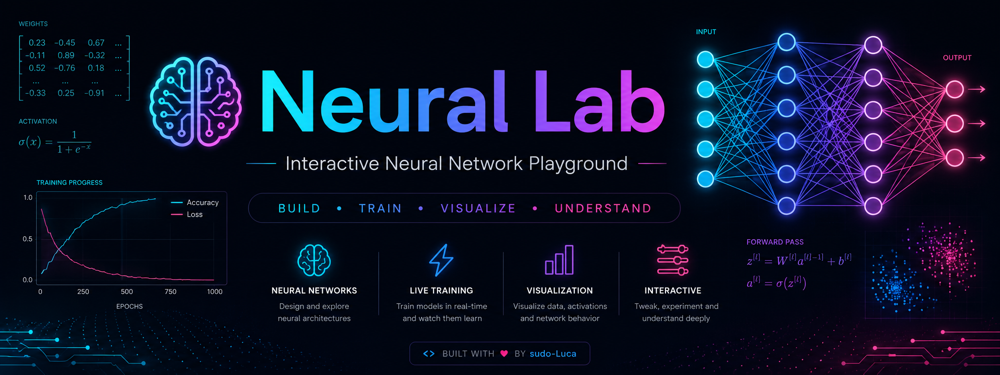
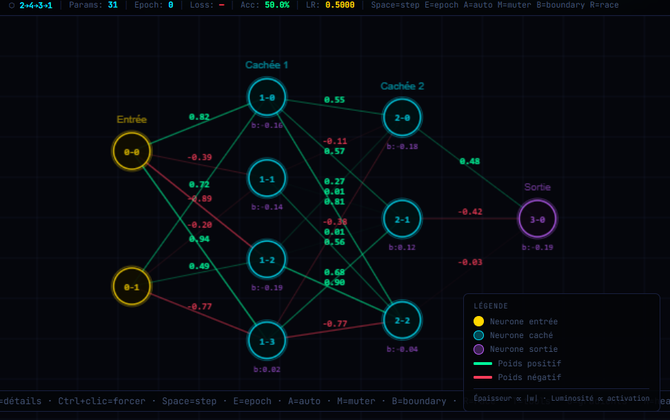
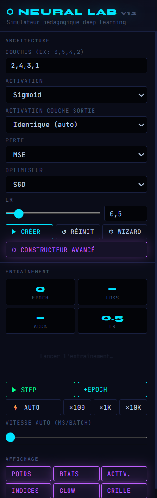
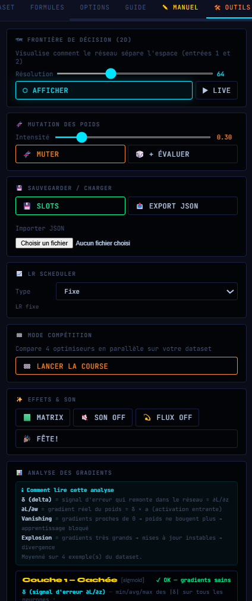
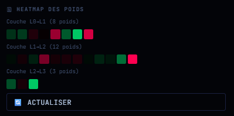
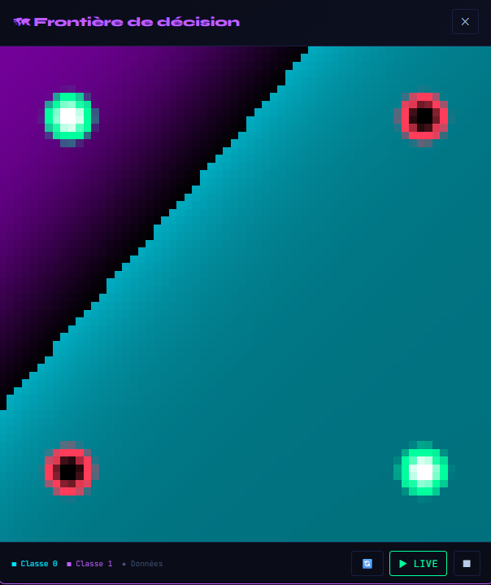
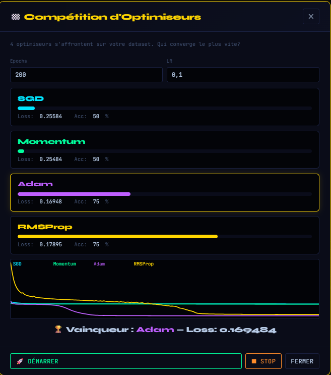
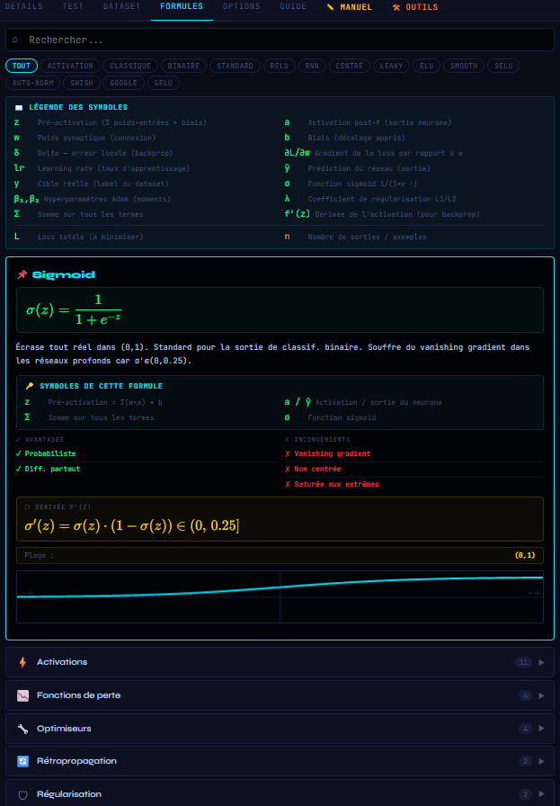
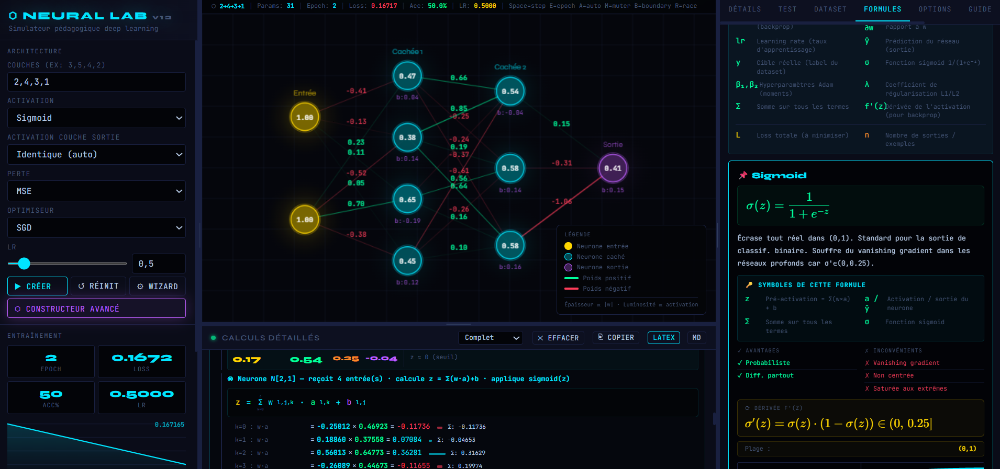
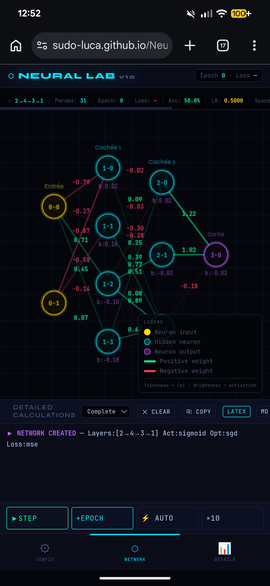

# 🧠 Neural Lab v12

> **A visual playground to understand neural networks — built from scratch in a single HTML file.**

<div align="center">



**Train. Visualise. Experiment. Understand.**

[Features](#-features) • [Screenshots](#-screenshots) • [Quick Start](#-quick-start) • [How it works](#-how-it-works) • [Try it online](https://sudo-luca.github.io/Neural-Lab/Neural-Lab-v12.html)

</div>

---

## ✨ What is Neural Lab?

Neural Lab is an interactive deep learning simulator designed to make neural networks understandable.

No framework.  
No installation.  
No server.

Just open **one HTML file** and start experimenting.

Every computation happens directly in your browser:

- Forward propagation
- Backpropagation
- Gradient calculation
- Weight updates
- Optimiser behaviour
- Decision boundaries
- Network visualisation

Built with **pure HTML + CSS + Vanilla JavaScript**.

---

## 🎥 See it in action

<!-- Replace with your own GIF -->


Watch a neural network learn in real time:
- neurons activating
- weights changing
- loss decreasing
- decision boundaries evolving

---

# 🚀 Features

## 🕸️ Visual Neural Network Playground

Create and observe multilayer perceptrons directly on the canvas.



Features:

✅ Custom architectures  
✅ Unlimited hidden layers  
✅ Per-layer activation functions  
✅ Live neuron activation display  
✅ Weight visualisation  
✅ Bias inspection  
✅ Interactive neuron and connection editing  


---

## 🔥 Train Neural Networks Step by Step

Understand what happens inside a model.



Training modes:

- Single step
- Single epoch
- Multiple epochs
- Automatic training
- Train until target loss

Every step can be inspected:

```
Input
 ↓
Forward Pass
 ↓
Prediction
 ↓
Loss
 ↓
Backpropagation
 ↓
Gradient Update
```

---

# 🧪 Experiment with Modern Deep Learning

Neural Lab includes many core concepts used in real machine learning.

## Activation Functions

Examples:

- Sigmoid
- ReLU
- Tanh
- Leaky ReLU
- ELU
- Swish
- GELU
- SELU
- Softsign
- Softmax
- ...


## Loss Functions

Available:

- Mean Squared Error
- MAE
- Binary Cross Entropy
- Huber Loss
- Hinge Loss
- Log Loss
- ...


## Optimisers

Compare different learning strategies:

- SGD
- Momentum
- RMSProp
- Adam
- AdamW
- Nesterov
- ...


---

# 📊 Visual Debugging Tools

Neural Lab is not just a trainer.

It is an exploration environment.




Included tools:

### Gradient Analysis

Find:

- Vanishing gradients
- Exploding gradients
- Layer imbalance


### Weight Heatmap

See how your network parameters evolve.




### Decision Boundary

Visualise what your classifier has learned.




### Optimiser Race

Run several optimisers against each other and watch who learns faster.




---

# 🎨 Designed for Learning

Neural Lab includes educational features:

- Formula library
- Step-by-step explanations
- Mathematical notation rendering
- Detailed training logs
- Interactive inspection





Instead of only seeing:

```
Loss = 0.034
```

you can explore:

```
How was the prediction computed?
Why did the gradient change?
Which weights were updated?
```

---

# ⚡ Quick Start

## Option 1 — Open directly

Download the project:

```bash
git clone https://github.com/sudo-Luca/Neural-Lab.git
```

Open:

```
Neural-Lab/Neural-Lab-v12.html
```

That's it.

No installation.
No build step.

---

## Option 2 — Run locally

Any modern browser works:

- Chrome
- Firefox
- Edge
- Safari


---

# 🧩 Example Experiments

## XOR Problem

A classic neural network challenge.

```
0 XOR 0 → 0
0 XOR 1 → 1
1 XOR 0 → 1
1 XOR 1 → 0
```

Try:

```
Input: 2
Hidden: 4
Output: 1
Activation: ReLU
Optimizer: Adam
```

---

## Spiral Classification

A harder nonlinear problem.


---

## Regression

Approximate mathematical functions:

```
y = sin(x)
```

Watch the network learn a curve.

---

# 📱 Works Everywhere

Desktop:




Mobile:




The interface automatically adapts:

- Responsive layout
- Touch-friendly controls
- Mobile navigation
- Full-screen panels


---

# 🏗️ Architecture

Neural Lab is intentionally simple:

```
Single HTML file

├── HTML
│   └── Interface
│
├── CSS
│   └── Dark UI system
│
└── JavaScript
    ├── Neural network engine
    ├── Training algorithms
    ├── Canvas renderer
    └── Interactive tools
```

No frameworks.

No hidden magic.

Everything is visible.

---

# 📚 Technical Documentation

For a complete technical description of:

- internal architecture
- neural computation
- backpropagation implementation
- optimiser formulas
- rendering engine
- dataset system
- v12 extensions

See:

➡️ [`Technical-Description.md`](Technical-Description.md)

---

# 🎯 Project Goals

Neural Lab was created with one idea:

> **Understanding neural networks should not require treating them as a black box.**

The goal is to make deep learning concepts:

- visual
- interactive
- experimental
- approachable


---

# 🛠️ Technologies

Built with:

| Technology | Usage |
|-|-|
| HTML5 Canvas | Neural visualisation |
| Vanilla JavaScript | Neural engine |
| CSS Variables | UI system |
| KaTeX | Mathematical rendering |


---

# 🌟 Roadmap

Possible future improvements:

- [ ] More architectures (CNN, RNN)
- [ ] More datasets
- [ ] WebGPU acceleration
- [ ] Model export/import improvements
- [ ] Collaborative experiments


---

# 🤝 Contributing

Ideas, improvements and experiments are welcome.

Feel free to open:

- Issues
- Feature requests
- Pull requests


---

# 📜 License

See repository license information.

---

<div align="center">

**Made for learning. Built for curiosity. 🧠**

</div>
